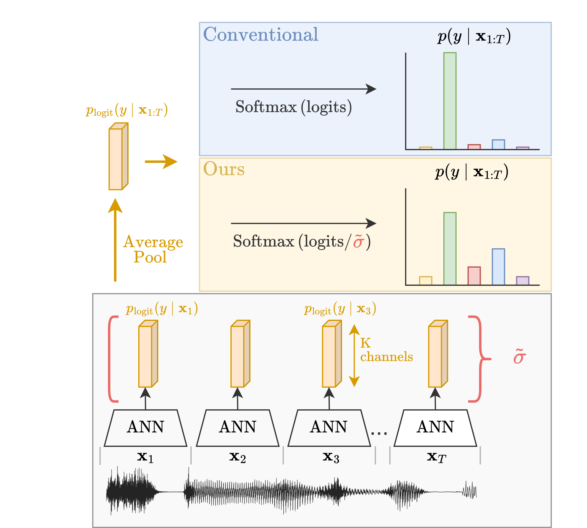

# Variance-Based Softmax Smoothing 

Since state-of-the-art uncertainty estimation methods are often computationally demanding, we investigate whether incorporating prior information can improve uncertainty estimates in conventional deep neural networks. Our focus is on machine learning tasks where meaningful predictions can be made from subsets of the data. For example, in speaker classification, the speech waveform can be divided into sequential patches, each containing information about the same speaker.

We observe that the variance between sub-predictions provides a reliable proxy for uncertainty in such settings. Our proposed variance-based scaling framework produces competitive predictive uncertainty estimates in classification while being less computationally demanding and allowing its integration as a post-hoc recalibration tool. 

This proposal also leads to a simple extension of deep ensembles, improving the expressiveness of their predicted distributions.




### Datasets:

1. Radio: download from [Google Drive](https://drive.google.com/drive/folders/14_K8s2uzS8qTCoZv9reSJ9M3M2GNAeVm?usp=drive_link) and save under `./data/RadioIdentification/*.pth`
2. LibriSpeech Subset: available at [loeweX/Greedy_InfoMax: Code for the paper: Putting An End to End-to-End: Gradient-Isolated Learning of Representations](https://github.com/loeweX/Greedy_InfoMax)
3. CIFAR-10: will auto-download when training on CIFAR-10.


## Commands

Example scripts to reproduce radio experiments. Execute the commands from the root dir of the project.

```shell
# Training - RADIO
python3 -m uncertainty.main --method UQ_rednd --num_models 1 --model_name model_0.pth --seed 0 --num_views 1 --redundancy_method identity --redundancy_method_params {} --UQ_predictor NA --predictor_params NA --epochs 30 --log_path ./logs/RADIO/normal/FIN_ACTIV=identity/nb_epochs=30_uai_01/ --dataset_path ./../data/ --dataset RADIO --remove_first_n_samples 500 --latent_dims [512,512,512,512,512] --latent_strides [5,4,1,1,1] --latent_kernel_sizes [10,8,4,4,4] --latent_padding [2,2,2,2,1] --final_activation identity --limit_train_batches 1.0 --limit_val_batches 1.0 --limit_test_batches 1.0 --fast_dev_run False --train True --wandb_analysis_independent_of_train_run False --use_wandb True --run_name X --wandb_entity XXXXXXXX --wandb_project tr_uai_01

# Evaluation - RADIO
python3 -m uncertainty.analysis.main --method UQ_rednd --num_models 1 --model_name model_0.pth --seed 0 --num_views 1 --redundancy_method identity --redundancy_method_params {} --UQ_predictor StdBasedSoftmaxRelaxation --predictor_params {std_on_representations:logits,tau_shift:auto,tau_amplifier:1,kernel_size:10} --epochs 30 --log_path ./logs/RADIO/normal/FIN_ACTIV=identity/nb_epochs=30_uai_01/ --dataset_path ./../data/ --dataset RADIO --remove_first_n_samples 500 --latent_dims [512,512,512,512,512] --latent_strides [5,4,1,1,1] --latent_kernel_sizes [10,8,4,4,4] --latent_padding [2,2,2,2,1] --final_activation identity --limit_train_batches 1.0 --limit_val_batches 1.0 --limit_test_batches 1.0 --fast_dev_run False --train True --wandb_analysis_independent_of_train_run True --use_wandb True --run_name X --wandb_entity XXXXXXXX --wandb_project an_uai_01
```


```shell
# Training - RADIO - MC-dropout
-m uncertainty.main --method mc_dropout --num_models 1 --model_name model_0.pth --seed 0 --num_views 1 --redundancy_method identity --redundancy_method_params {} --UQ_predictor NA --predictor_params NA --epochs 30 --log_path ./logs/RADIO/mc_dropout/FIN_ACTIV=identity/nb_epochs=30_uai_01/ --dataset_path ./../data/ --dataset RADIO --remove_first_n_samples 500 --latent_dims [512,512,512,512,512] --latent_strides [5,4,1,1,1] --latent_kernel_sizes [10,8,4,4,4] --latent_padding [2,2,2,2,1] --final_activation identity --limit_train_batches 1.0 --limit_val_batches 1.0 --limit_test_batches 1.0 --fast_dev_run False --train True --wandb_analysis_independent_of_train_run False --use_wandb True --run_name X --wandb_entity XXXXXXXX --wandb_project tr_uai_01

# Evaluation - RADIO - MC-dropout
-m uncertainty.analysis.main --method mc_dropout --num_models 1 --model_name model_0.pth --seed 0 --num_views 1 --redundancy_method identity --redundancy_method_params {} --UQ_predictor MCDropout --predictor_params {num_samples:10} --epochs 30 --log_path ./logs/RADIO/mc_dropout/FIN_ACTIV=identity/nb_epochs=30_uai_01/ --dataset_path ./../data/ --dataset RADIO --remove_first_n_samples 500 --latent_dims [512,512,512,512,512] --latent_strides [5,4,1,1,1] --latent_kernel_sizes [10,8,4,4,4] --latent_padding [2,2,2,2,1] --final_activation identity --limit_train_batches 1.0 --limit_val_batches 1.0 --limit_test_batches 1.0 --fast_dev_run False --train True --wandb_analysis_independent_of_train_run True --use_wandb True --run_name X --wandb_entity XXXXXXXX --wandb_project an_uai_01
```

The experiments for the other datasets can be executed similarly by overwriting the flag `--dataset RADIO` into `CIFAR10` or `LIBRISPEECH_GIM_SUBSET`. See for `./shared/hyperparameter` for a list of overwritable variables and their respective values.
